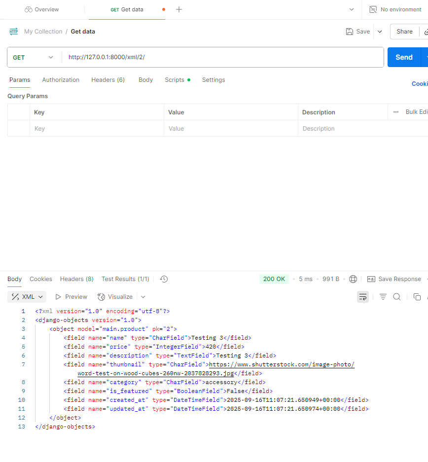
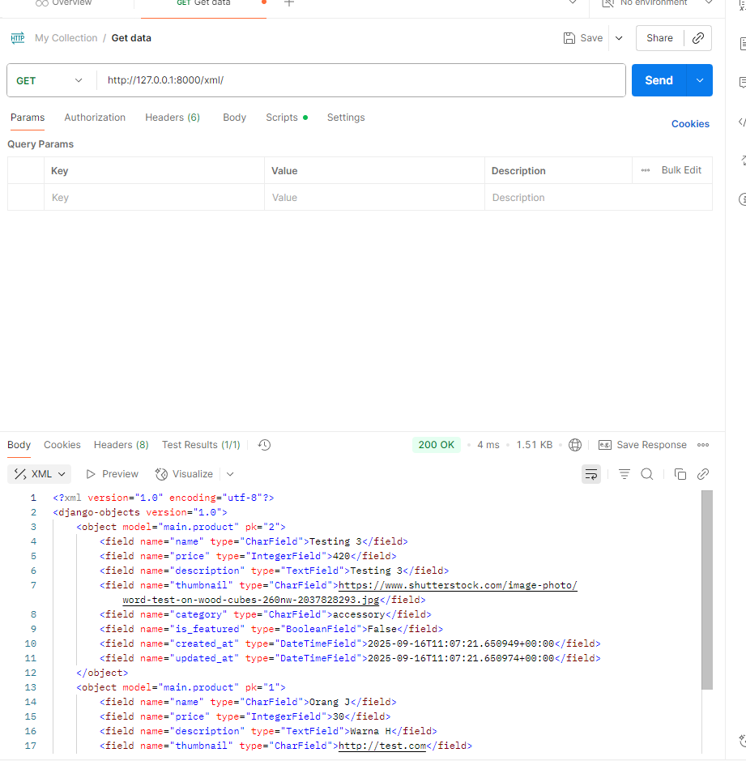
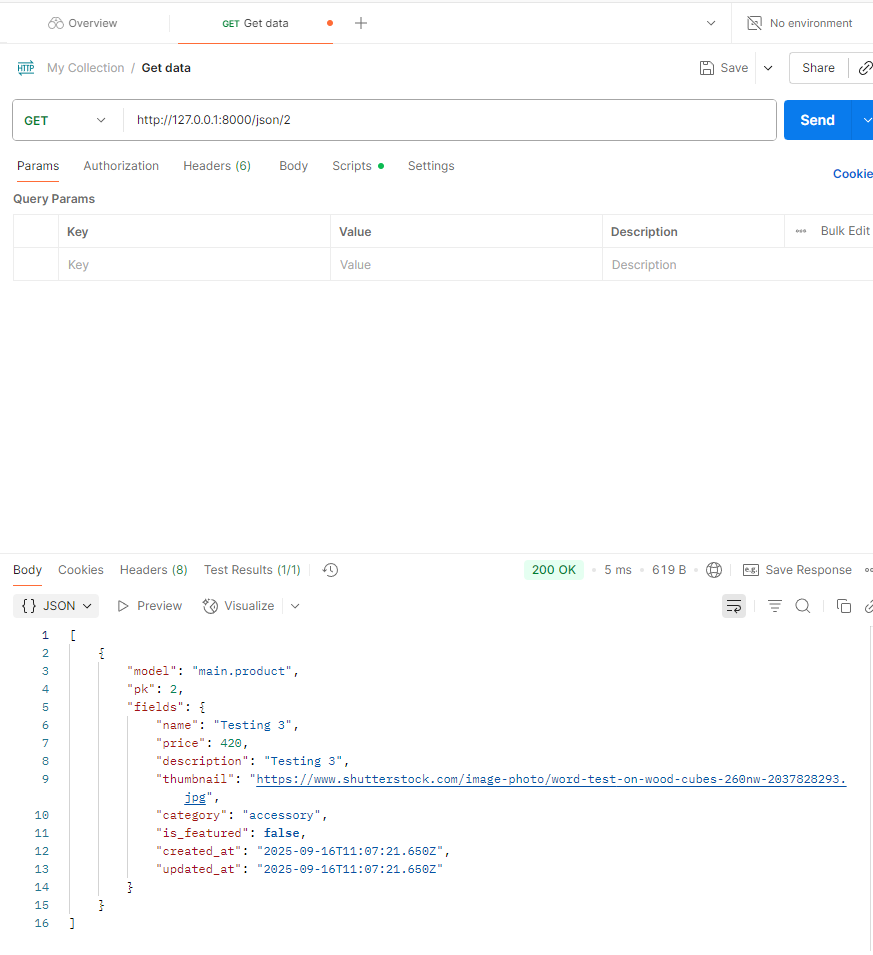
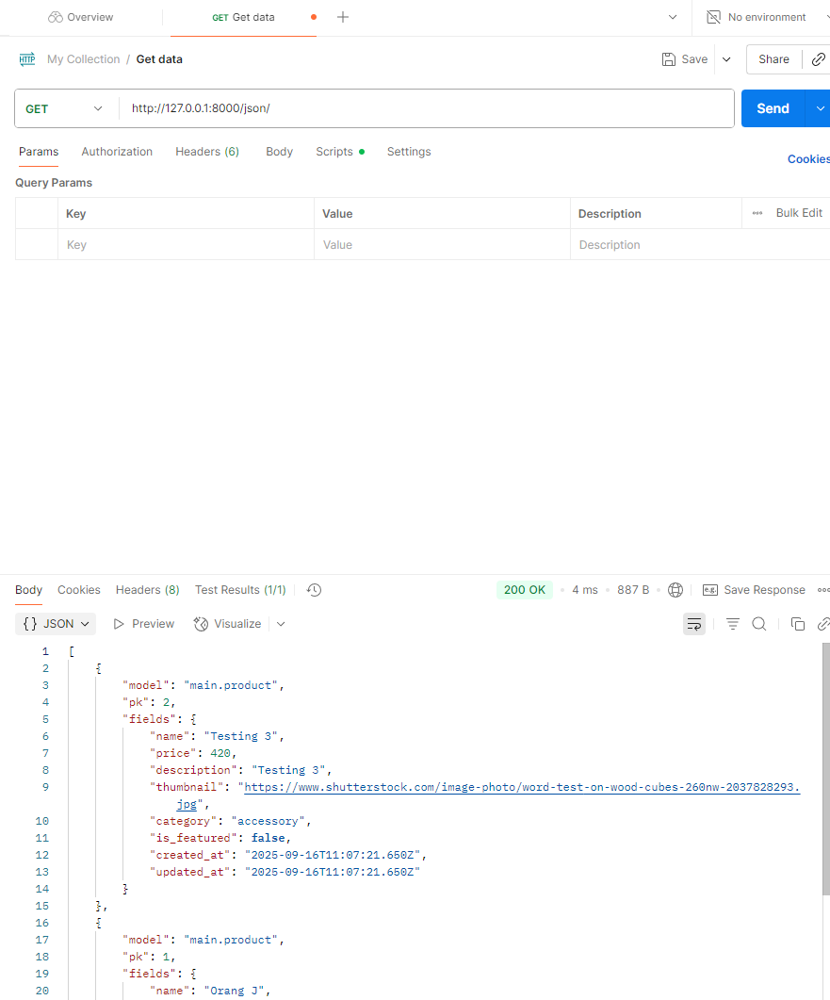

Name: M. Adra Prakoso
NPM: 2406453530
Class: PBP KKI

---

# Football Shop

Live (PWS): https://muhammad-adra41-footballshop.pbp.cs.ui.ac.id/

This is a small Django app for the assignment. One project (`football_news`), one app (`main`), one `Product` model, a view that renders some personal info and product data, and a simple template. Deployed to PWS.

## What I did
1. `django-admin startproject football_news`.
2. `python manage.py startapp main`, then add `main` to `INSTALLED_APPS` in `settings.py`.
3. Wire URLs: in project `urls.py` include `main.urls`; in `main/urls.py` map `''` to `show_main`.
4. Make `Product` in `main/models.py` with these fields (as required):
	- name (CharField)
	- price (IntegerField)
	- description (TextField)
	- thumbnail (URLField)
	- category (CharField)
	- is_featured (BooleanField)
	I also added timestamps and some category choices. Not strictly needed, just convenient.
5. `makemigrations` and `migrate` so the table exists.
6. Basic view `show_main` returns `app_name`, my name/class, and a queryset of products to the template.
7. Template `main.html` prints the info and loops products.
8. Deployment: added my PWS domain to `ALLOWED_HOSTS`.

## MVT in 3 lines
- `urls.py` picks the view based on the path.
- `views.py` gathers data and calls `render` with a context.
- `models.py` defines `Product` and lets me query without writing raw SQL.
- `main.html` uses the context to produce the final HTML.

## What `settings.py` does 
Project configuration lives here: installed apps, middleware, database settings, templates, static files, allowed hosts, debug flag, and so on. In this repo the database is always SQLite (local and PWS), and I listed the PWS domain in `ALLOWED_HOSTS` so it actually serves.

## How migrations work (quick)
1. Change models.
2. `makemigrations` creates migration files describing schema changes.
3. `migrate` applies them to the DB and records which ones ran.
That’s it. If you edit models again, repeat.

## Why Django for an intro course (my take)
- Comes with a lot of built-ins (admin, auth, ORM) so you can focus on concepts.
- Clear structure; easier to grade and to collaborate.
- Good docs and a stable ecosystem.
- Reasonably secure defaults (CSRF, etc.).

## Feedback for Tutorial 1
It was fine.

## Notes
- Local dev: DEBUG on, SQLite. Prod: still SQLite; domain is already in `ALLOWED_HOSTS`.
- The extra `News` model is unrelated to the assignment; I left it in for testing.

---

## Assignment Checklist

- DONE: 4 new view functions for data formats
- DONE: URL routes for each view
- DONE: Product list page with Add button and per-item Detail button
	- List: `/` (shows all products)
	- Add: `/add/`
	- Detail: `/product/<id>/`
- DONE: Form page to add product objects
- DONE: Detail page for each product
- DONE: Postman screenshots added: embedded below

### Postman Endpoints to Capture

Use these four GET endpoints in Postman, then add screenshots here:

1. All products XML: `https://muhammad-adra41-footballshop.pbp.cs.ui.ac.id/xml/`
2. All products JSON: `https://muhammad-adra41-footballshop.pbp.cs.ui.ac.id/json/`
3. Product by ID XML: `https://muhammad-adra41-footballshop.pbp.cs.ui.ac.id/xml/<id>/`
4. Product by ID JSON: `https://muhammad-adra41-footballshop.pbp.cs.ui.ac.id/json/<id>/`

Screenshots:

If you're running locally, the base is `http://127.0.0.1:8000/`.
---

## Authentication Assignment 4

This assignment adds user login, registration, and logout to the Django app, plus connects products to users and shows some user info.

### What I Completed

**User registration, login, and logout** - Used Django's built-in auth system  
**Two test user accounts** - Made them with a script  
**Linked products to users** - Added a foreign key in the Product model  
**Show user details and last login cookie** - On the home page  
**Answered the assignment questions** - See below  

### Assignment Questions and Answers

#### 1. What is Django's AuthenticationForm? Explain its advantages and disadvantages.

**Answer:** Django's `AuthenticationForm` is a form that comes with Django for logging in users. It checks the username and password against the database.

**Advantages:**
- Works right out of the box with Django's auth system
- Handles security stuff like password checking automatically
- Saves time since you don't have to build it from scratch
- Can be tweaked if needed
- Shows errors and validates the form for you

**Disadvantages:**
- Only does basic username/password login
- Need to add extra stuff for things like two-factor auth
- Might give away too much info in error messages if you're not careful
- Not as flexible as making your own custom login form

#### 2. What is the difference between authentication and authorization? How does Django implement the two concepts?

**Answer:** 

**Authentication** is figuring out who you are (like logging in), while **Authorization** is deciding what you can do once you're logged in (like permissions).

**Django Implementation:**

**Authentication:**
- Uses the `django.contrib.auth` stuff to check user identities
- The `User` model holds login info
- Backends verify your credentials (usually against the database)
- Views and functions like `login()` keep track of who's logged in
- Sessions remember you're logged in across pages

**Authorization:**
- Has a permission system with models and decorators like `@permission_required`
- Groups let you bundle permissions
- Decorators like `@login_required` block access if you're not logged in
- Mixins for views to require permissions
- Default permissions for adding, changing, deleting, or viewing stuff in models

#### 3. What are the benefits and drawbacks of using sessions and cookies in storing the state of a web application?

**Answer:**

**Benefits:**
- **Sessions:** Stored on the server, so safer from messing with on the client side; can hold lots of data; can clean up automatically
- **Cookies:** Stored on the user's browser, saves server space; stick around even after closing the browser; help personalize things
- **Together:** Keep track of state in HTTP, which doesn't remember stuff; let users stay logged in; make the site feel smoother

**Drawbacks:**
- **Sessions:** Use up server memory or storage; harder to scale if you have multiple servers; sessions can expire weirdly
- **Cookies:** Limited to about 4KB; can be stolen via attacks like XSS or CSRF; privacy issues; users can turn them off
- **General:** Managing sessions is a pain; security holes if not done right

#### 4. In web development, is the usage of cookies secure by default, or is there any potential risk that we should be aware of? How does Django handle this problem?

**Answer:**

**Cookies are NOT secure by default.** Big risks include:

**Potential Risks:**
- **Sniffing:** If not using HTTPS, cookies can be intercepted
- **XSS:** Bad scripts can grab your cookies
- **CSRF:** Cookies get sent automatically, which attackers can exploit
- **Session stealing:** If someone gets your session cookie, they can pretend to be you

**Django's Security Measures:**
- **HttpOnly flag:** Stops JavaScript from touching session cookies
- **Secure flag:** Only sends cookies over HTTPS
- **SameSite:** Helps stop CSRF by controlling when cookies are sent
- **CSRF protection:** Built-in tokens and middleware
- **Signed cookies:** Functions to sign cookies so they can't be tampered with
- **Session stuff:** Rotates keys and lets you set timeouts

#### 5. Explain how you implemented the checklist above step-by-step (not just following the tutorial).

**Answer:**

**Step 1: Set up Django Auth**
- Added `'django.contrib.auth'` to `INSTALLED_APPS` in `settings.py`
- Put `'django.contrib.auth.context_processors.auth'` in the template processors
- Set up `LOGIN_URL`, `LOGIN_REDIRECT_URL`, and `LOGOUT_REDIRECT_URL`

**Step 2: Connect Products to Users**
- Changed the `Product` model to add `user = models.ForeignKey(User, on_delete=models.CASCADE, related_name='products', null=True)`
- In the `add_product` view, set `product.user = request.user`
- Ran migration `0004_product_user.py` to update the database

**Step 3: Registration**
- Made a `RegistrationForm` based on `UserCreationForm` with an email field
- Wrote a `register` view that saves the user and logs them in right away
- Created `register.html` with the form and links to navigate

**Step 4: Login and Logout**
- Built `login_user` view using `AuthenticationForm` to check credentials
- Made `logout_user` view to clear the session and send back to login
- Designed `login.html` with error messages and validation

**Step 5: Home Page with User Info**
- Added a `home` view with `@login_required` to protect it
- Showed `username` and `last_login` from the User model
- Set a cookie: `response.set_cookie('last_login', last_login.strftime('%Y-%m-%d %H:%M:%S'))`
- Made `home.html` to display user stats and their products

**Step 6: URLs**
- Updated `main/urls.py` with paths for home, register, login, logout
- Rearranged to make auth flow the main thing
- Made home the default page for logged-in users

**Step 7: Templates**
- Kept styling consistent across register, login, and home pages
- Added nav links between pages
- Put in error handling and feedback

**Step 8: Dummy Data**
- Wrote `create_dummies.py` using Django's user creation tools
- Made two users (`footballer1`, `footballer2`) with emails
- Added three products each with football shop stuff
- Assigned products to the right users

**Step 9: Testing**
- Tested the whole flow: register, login, access control, logout
- Checked that products are user-specific
- Made sure cookies and sessions work
- Verified redirects and restrictions

I focused on using Django's built-in security features, good session handling, and safe cookies, while keeping the UI simple and easy to use.

---

## Assignment 5: Web Design & Product Management

- **Added edit/delete buttons** to each product card so users can manage their own stuff
- **Made everything responsive** with Bootstrap - the navbar collapses on mobile, cards stack nicely, looks great on any screen
- **Redesigned all pages** - login/register got fancy gradients, product forms are clean and centered, the product list shows cards with images and details
- **Handled empty states** - when no products exist, shows a friendly message with an image
- **Answered the questions** about CSS priority, responsive design, margins/borders/padding, flexbox/grid, and how I implemented everything step-by-step

## Assignment 6 – AJAX Enhancements

### What I implemented
- Replaced the server-rendered product grid with a single-page shell that fetches data from `/api/products/` and renders it client-side (`main/static/main/js/products.js`).
- Added REST-style JSON endpoints for product CRUD and authentication (`main/views.py`) and wired them in `main/urls.py`.
- Crafted Bootstrap modals for create/update/delete, complete with inline validation, loading/error/empty states, and a refresh control (`main/templates/main.html`).
- Built a custom toast system (`main/static/main/js/toasts.js` + `main/static/main/css/toasts.css`) to surface success/error feedback for products and auth.
- Converted login, register, and logout into fully asynchronous flows with CSRF protection and inline error mapping (`main/static/main/js/auth.js`).

### Required questions

#### 1. What is the difference between synchronous request and asynchronous request?
Synchronous requests block the caller until the server replies, so the browser cannot respond to user input and the UI appears frozen. Asynchronous requests run in the background; JavaScript sends the request, keeps the event loop free, and processes the response later via callbacks or promises. In this project the old synchronous form submissions caused full page reloads, whereas the new `fetch` calls update just the affected components, keeping the rest of the page interactive.

#### 2. How does AJAX work in Django (request–response flow)?
The browser issues an XMLHttpRequest/`fetch` with JSON payloads and a CSRF header. Django routes the request through `urls.py` to the API view, where I validate forms, serialize `Product` objects, and return a `JsonResponse`. The promise resolves in the frontend, which inspects the JSON (success/errors) and mutates the DOM—e.g., re-rendering the product grid or showing validation feedback—without a full template render.

#### 3. What are the advantages of using AJAX compared to regular rendering in Django?
AJAX avoids layout shifts and template re-renders, so the perceived speed is much higher. We transfer only lightweight JSON instead of whole HTML pages, reduce server template work, and can compose state-dependent UI logic (loading/empty/error) on the client. It also lets multiple UI sections update independently; for example, the product list refreshes after mutations while the modal stays open just long enough to show a toast.

#### 4. How do you ensure security when using AJAX for Login and Register features in Django?
Every POST/PUT/DELETE request carries an `X-CSRFToken` header sourced from Django’s cookie, and all endpoints call `@login_required` or verify ownership before mutating data. Password handling still goes through Django’s `AuthenticationForm` and `UserCreationForm`, so hashing and validation stay server-side. The views return minimal error detail, use HTTPS-friendly settings (`CSRF_TRUSTED_ORIGINS`), and log users out by invalidating the session server-side—so even though the frontend is asynchronous, authentication state is controlled by Django’s secure session middleware.

#### 5. How does AJAX affect user experience (UX) on websites?
Users get immediate visual feedback: the loading spinner appears while data is in flight, empty/error states explain what happened, and bespoke toasts confirm each action. Because the page never fully reloads, scroll position, focus, and modal state persist, which makes the interaction feel fluid and app-like. Combined with the refresh button and real-time grid updates, the UX now feels responsive and trustworthy.